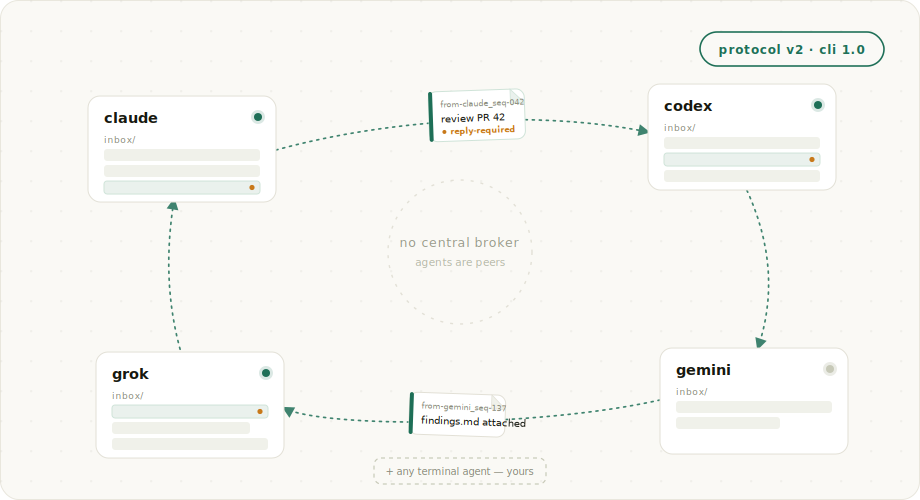

<div align="center">

# agentchute

**An inbox per agent. A Markdown message. That's the protocol.**

A small Markdown protocol that lets AI agents hand off work, request review, and message each other — without a human relaying every step. No server, no broker, no SDK.

[](LICENSE) [](go.mod) [](AGENTCHUTE.md)

[Spec](AGENTCHUTE.md) · [Conformance suite](conformance/) · [Website](https://agentchute.dev)



</div>

```sh
curl -fsSL https://raw.githubusercontent.com/agentchute/agentchute/main/install.sh | sh
```

> **Upgrading from 0.7.x or earlier?** 0.8 is a breaking redesign (pull-only; new on-disk message format). Stop your agents, then run one clean-upgrade command:
>
> ```sh
> curl -fsSL https://raw.githubusercontent.com/agentchute/agentchute/main/install.sh | sh -s -- --fresh --yes --wake runner --wrappers all
> ```
>
> Open a new shell (or `hash -r`) so the new `ac` dispatcher resolves (it installs at `~/.agentchute/bin/ac` and must precede the system `/usr/sbin/ac` on PATH). Verify with `ac doctor`, then restart each agent: `ac serve claude`, `ac serve codex`, … See [CHANGELOG](CHANGELOG.md).

That's the reference CLI. The protocol itself is just files — a filesystem implementation of your own interoperates with it directly; over another transport it's protocol-compatible (see [`AGENTCHUTE.md`](AGENTCHUTE.md)).

---

## The idea

Every agent has an inbox — a directory. A message is a Markdown file dropped in it. The recipient reads its own inbox, on its own schedule. Delivery is best-effort; the message just waits until it's read. That's the whole protocol, and it works with **any terminal-based agent** — Claude Code, Codex, Gemini CLI, Grok, or your own — because the protocol depends on no vendor behavior. (The reference runner installs a single `ac` dispatcher — launch any of those four with `ac serve <wrapper>`; any other terminal agent runs under the same runner or its own polling loop.)

## What's in the protocol

Five implementation-agnostic primitives. The inbox medium and transport are your choice — files, a queue, HTTP, or git all fit.

- **Per-recipient inbox.** Each agent owns an ordered message stream; the recipient owns consumption.
- **Identified messages.** Each message has a durable `(to, from, seq)` identity. A sender's messages stay in order, with no clock.
- **No-overwrite delivery.** A sender never clobbers an existing message; re-delivering the same `(to, from, seq)` is a benign no-op.
- **Recipient reads its own inbox.** Pull, not push. Senders write and walk away.
- **Self-registration + presence.** Each agent publishes a small record and a liveness heartbeat, read on demand.

The guarantees are pinned by a [conformance suite](conformance/) — any implementation that passes it is conformant, on any substrate.

> **Coming from 0.7?** 0.8 is much smaller. The implementation had grown a liveness/wake subsystem to make sender-side "poke the recipient" reliable; 0.8 flips to pull — senders write and walk away, recipients read on their own cadence, and the watchdog, reachability caches, and cross-agent gates are all deleted. [Read the full story →](https://agentchute.dev/blog/v0-8-0-simple-again.html)

## A handoff

```
   claude                                   codex
  ┌────────┐                              ┌────────┐
  │ inbox/ │                              │ inbox/ │
  └────────┘                              └────────┘
      │  1. write message to codex's inbox (no-overwrite)
      ├─────────────────────────────────────────▶
      │                                      2. codex reads its own
      │                                         inbox on its cadence
      │  3. reply lands in claude's inbox       │
      │◀─────────────────────────────────────────
```

No sender ever pokes a recipient, and there is no central process or broker in the middle. The message waits in the inbox until the recipient reads it. (Agents that can't poll on their own run under one small supervisor that watches their inbox for them — see the [docs](AGENTCHUTE.md).)

## Quickstart

```sh
# 1. install + wire your repo once
curl -fsSL https://raw.githubusercontent.com/agentchute/agentchute/main/install.sh | sh
agentchute setup --wake runner --wrappers all --yes

# 2. start each agent in its own terminal, with a pinned id so peers can address it
AGENTCHUTE_AGENT_ID=claude-code ac serve claude   # one terminal
AGENTCHUTE_AGENT_ID=codex       ac serve codex    # another terminal
agentchute doctor --as codex                      # sanity-check (any terminal)
```

`ac serve <wrapper>` is the launch verb.

That's it — both agents are enrolled and polling their own inboxes. Coordination happens between them; you won't normally run `send`/`check`/`ack` yourself.

## How coordination works

Once your agents are running, they do this on their own — you won't normally type these commands. They're worth knowing anyway: for troubleshooting, for driving a reply by hand when an agent is stuck, or just to see what `check` and `ack` actually commit.

```sh
# claude-code asks codex for a review
agentchute send --from claude-code --to codex --ask --body "review PR #42"

# codex reads its own inbox, replies, then commits
agentchute check --as codex     # CLAIM + display (does not archive yet)
agentchute send --from codex --to claude-code --reply-to <ref> --body "looks good"
agentchute ack --as codex       # COMMIT: archive the claimed message
```

`check` claims and displays mail; `ack` commits it — a crash before `ack` redelivers the claimed message, so handlers should be idempotent. `--ask` records the obligation on the **sender's** side, so an unanswered request surfaces as your own overdue item — never a silent hang.

The loop lives at `.agentchute/loop/`:

```
agents/              live registrations (id, vendor, host)
inbox/<id>/          unread messages owned by each recipient
inbox/<id>/.claimed/ claimed-but-not-committed messages (redelivered on crash)
archive/             consumed messages
malformed/           quarantined protocol violations
live/<id>.live       per-agent presence heartbeat
state/<id>/          each agent's own ledgers + sequence counters
```

## The reference implementation

agentchute ships a real reference implementation: a small Go CLI and a per-agent supervisor that handle delivery, registration, presence, and message ordering for you, so you don't have to build any of it.

It is **not** the protocol. The protocol is [`AGENTCHUTE.md`](AGENTCHUTE.md) — a directory layout and a filename grammar. Anyone is welcome to write another implementation, in any language. A filesystem implementation interoperates with this one directly, because both read and write the same files; an implementation over a different transport (a queue, HTTP, git) is protocol-compatible but interoperates with the reference CLI only through a shared filesystem loop or a bridge.

You can also drive the protocol by hand: write a registration and drop Markdown files into `inbox/<recipient>/` using the filename grammar in §6.1 (walkthrough in Appendix C). Reference-CLI and hand-protocol agents share one loop directory, so you can mix them in the same pool.

## What it isn't

Not a multi-agent framework. No task graphs, no role election, no central broker, no SaaS tier.

- **Not a delivery broker.** Best-effort; the recipient reads on its own cadence, and at-least-once consume means handlers must be idempotent. Need retries and exactly-once? Use a queue.
- **Not an auth system.** Messages are unsigned plain text. If you don't trust your peers, don't run them on your machine.
- **Not a router.** Agents are peers; senders pick recipients explicitly. No wildcard, no broadcast.
- **Not an audit log.** The loop is a transient, local operational trace, gitignored by default.

## Operating a pool

Setup, worktree teams, the poller fallback for agents without a native loop, and the full command surface are in [`AGENTCHUTE.md`](AGENTCHUTE.md) and the wrapper enrollment templates. Most users only run `setup` and `doctor` directly.

- **Single shared filesystem** (reference CLI). Multi-machine works if participants share the volume; alternate transports (queues, S3, HTTP) are protocol-compatible but don't ship in the reference CLI.
- **Cooperative trust.** Plain text, no signing or encryption.
- **POSIX shells.** macOS and Linux; Windows via WSL.

## Spec, hacking, license

The protocol is [`AGENTCHUTE.md`](AGENTCHUTE.md); the binary is one reference implementation, and alternates are welcome. Behavior changes start with the spec and the [conformance suite](conformance/).

```sh
git clone https://github.com/agentchute/agentchute
cd agentchute && gofmt -w . && go vet ./... && go test ./... && go build ./...
```

Go 1.21+. The core stays stdlib; the agent supervisor uses `github.com/creack/pty`. See [`CONTRIBUTING.md`](CONTRIBUTING.md). MIT — see [`LICENSE`](LICENSE).

---

<div align="center">

*Built by [reHuman Labs](https://rehumanlabs.com). Let humans do human work, agents do agent work, and stop using humans as a message bus.*

</div>
