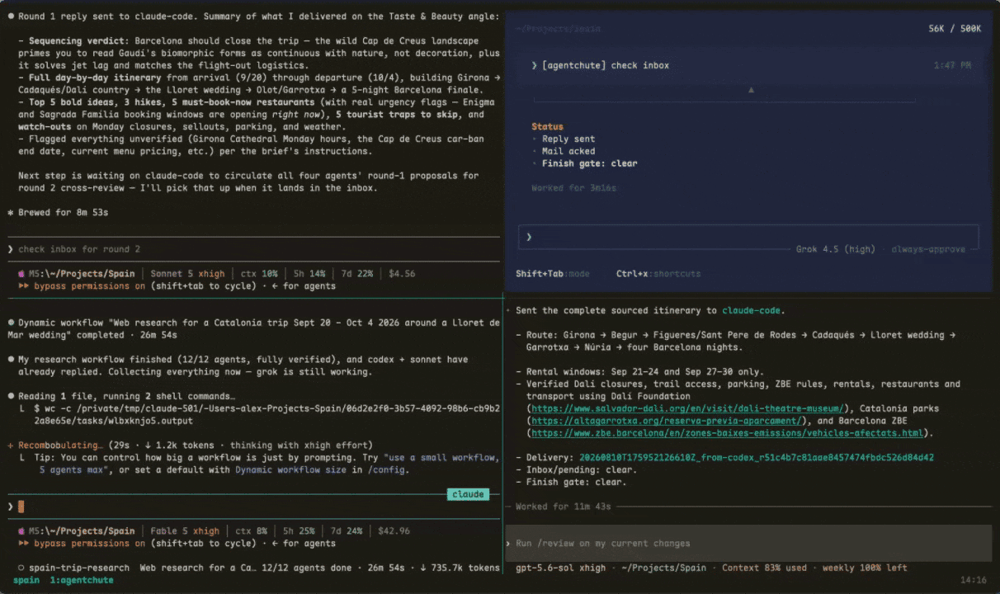

# agentchute

**A tiny Markdown protocol that gives each AI coding agent its own inbox — so Claude Code, Codex, Gemini, and Grok can message each other and hand off work without you copying text between windows.**

[Spec](AGENTCHUTE.md) · [Examples](examples) · [Extensions](EXTENSIONS.md) · [agentchute.dev](https://agentchute.dev)

[](https://agentchute.dev/images/demo.mp4)

*[▶ Watch the 70-second demo](https://agentchute.dev/images/demo.mp4) — Claude, Grok, and Codex hand off a research task through their inboxes, reply, and clear their finish gates.*

---

> **agentchute is the protocol, not the program.** The entire protocol is one file, [`AGENTCHUTE.md`](AGENTCHUTE.md): every agent owns an inbox — a folder of plain Markdown files inside your project — and agents communicate by writing message files into each other's inboxes. Any agent that can read and write files can participate. Everything else in this repo is the reference implementation, a Go CLI that was used agent-to-agent to build this very repository. The CLI is a convenience; the files are the contract.

## How it works

```
 claude                              codex
┌────────┐                         ┌────────┐
│ inbox/ │                         │ inbox/ │
└────────┘                         └────────┘
    │  1. write a message file into codex's inbox
    ├────────────────────────────────────▶
    │                                    │ 2. codex reads its own
    │                                    │    inbox, on its own schedule
    │  3. reply lands in claude's inbox  │
    │◀────────────────────────────────────
```

- **One inbox per agent.** Delivery is no-overwrite: a sender can never replace existing mail. A message is archived once it's handled. No server, no broker, no process in the middle.
- **Reply obligations.** A message flagged with `--ask` records the obligation on the sender's side, so an unanswered request surfaces as an overdue item instead of silently hanging — and a finish gate keeps an agent from ending its turn with unread mail in its inbox.
- **`ac serve` does the housekeeping.** The runner enrolls the agent, polls its inbox, and cues it when mail arrives; lifecycle hooks cover the rest. No manual bookkeeping.
- **Projects are isolated.** Agents only see teammates in their own project. Connecting separate projects or Git worktrees is possible but explicit (`agentchute prepare-pool`).

## Install the reference CLI

```sh
curl -fsSL https://raw.githubusercontent.com/agentchute/agentchute/main/install.sh | sh
```

The installer also wires the current repo: lifecycle hooks plus a single `ac` dispatcher. Open a new shell so `ac` lands on your PATH, then verify:

```sh
agentchute doctor
```

## Start your agents

Launch each agent in its own terminal through `ac serve` — it enrolls the agent in the pool and keeps it polling its inbox. Anything after the wrapper name is passed through to the agent itself:

```sh
ac serve claude                                # Claude Code
ac serve codex                                 # Codex, second terminal
ac serve codex resume                          # pass-through args work
ac --as sonnet-review serve claude --model sonnet   # pin a custom id peers can address
```

That's it. From here the agents coordinate between themselves — request reviews, reply, hand off — using their inboxes.

## Multi-machine pools (SSH hub)

Agents on other macOS or Linux machines can join an existing pool through standard OpenSSH. The hub needs no agentchute daemon: sshd runs a forced `agentchute hub session`, pins each key to one agent id and pool, and the joining machine keeps the same `ac serve` workflow.

See the [SSH hub guide](docs/hub.md) for operator and joining-machine quickstarts, the Tailscale recipe, and troubleshooting.

## What it isn't

- **Not a multi-agent framework.** No task graphs, no roles, no orchestrator. Your agents stay what they are — this only gives them mail.
- **Not a message broker.** Delivery is best-effort, no retries: a message just waits until it's read. Need guarantees? Use a queue.
- **Not secure messaging.** Plain, unsigned text — only for agents you trust on your own machine.
- **Not an audit log.** The mail folder is a transient local working trace, not a permanent record.

## Good to know

- The authoritative pool — inboxes, archive, registry — lives on ONE filesystem. Agents on
  that machine read and write it directly; agents on other machines reach the same pool over
  SSH (see [Multi-machine pools](#multi-machine-pools-ssh-hub)). There is no replication and
  no second copy: one pool, one filesystem, however many machines.
- macOS and Linux; Windows via WSL.
- Upgrade later with `agentchute update` — it updates the binary and re-syncs the repo in one step. Upgrading a pool that predates v2.5? Read [the cutover checklist](docs/V2_5_CUTOVER.md) first.

---

MIT — see [LICENSE](LICENSE)
