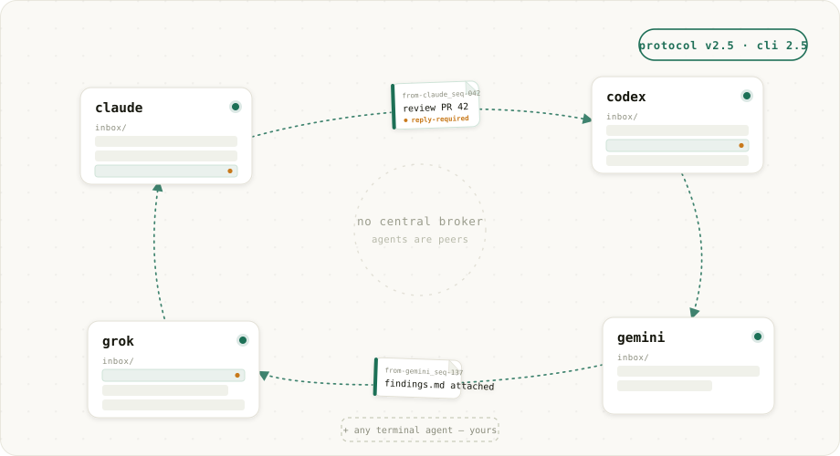

<div align="center">

# agentchute

**An inbox per agent. A Markdown message. That's the protocol.**

**Protocol v2.5 · Reference CLI v1.5**

A small Markdown protocol that lets AI agents hand off work, request review, and message each other — without a human relaying every step. No server, no broker, no SDK.

[](AGENTCHUTE.md) [](CHANGELOG.md) [](LICENSE) [](conformance/)

[Spec](AGENTCHUTE.md) · [Conformance](conformance/) · [Extensions](EXTENSIONS.md) · [Website](https://agentchute.dev) · [Why the wire moved →](https://agentchute.dev/blog/v2-5-the-wire-broke.html)



</div>

```sh
curl -fsSL https://raw.githubusercontent.com/agentchute/agentchute/main/install.sh | sh
```

Already installed? Read the [v2.5 cutover checklist](docs/V2_5_CUTOVER.md) before `agentchute update`. This release changes the wire and must be upgraded pool-at-once; never use `--no-resync` for the first old→v2.5 update.

That's the reference CLI. The protocol itself is just files — an implementation of your own interoperates with it directly, and the [conformance vectors](conformance/) tell you whether you got it right.

---

## What 1.0 means here

**Done, not big.** Most projects reach 1.0 by adding; agentchute got here by deleting. The pull-only redesign removed the watchdog, the wake adapters, and the reachability machinery; one release alone removed 8,262 lines; every release since is required to remove something. What's left is the stable core:

- **Protocol v2 was declared stable.** *Stable* was meant SemVer-serious, not rhetorical: the covenants — the primitives (§1), the envelope (§6.4), the identity grammar (§6.1), the lifecycle guarantees — were to change only through the written deprecation process. The primitives, envelope, and lifecycle guarantees held. **The identity grammar didn't**: v2.5 replaces it (see [`AGENTCHUTE.md`](AGENTCHUTE.md)'s own top note and [the write-up](https://agentchute.dev/blog/v2-5-the-wire-broke.html)) — a real wire break, walked back openly rather than smuggled into a minor.
- **CLI v1.5.x implements Protocol v2.5.** Registration rows carry integer `v: 3`; `status` and `doctor` render it as v2.5 and warn on mixed pools.
- **Honesty clause:** the protocol had been stable since v0.10.0 through 1.0; v2.5 is the first time that changed, and this section says so rather than quietly updating the claim above it.

## The idea

Every agent has an inbox — a directory. A message is a Markdown file dropped in it. The recipient reads its own inbox, on its own schedule. Delivery is best-effort; the message just waits until it's read. That's the whole protocol, and it works with **any terminal-based agent** — Claude Code, Codex, Gemini CLI, Grok, or your own — because the protocol depends on no vendor behavior. (The reference runner installs a single `ac` dispatcher — launch any of those four with `ac serve <wrapper>`; any other terminal agent runs under the same runner or its own polling loop.)

## What's in the protocol

Five implementation-agnostic primitives. The inbox medium and transport are your choice — files, a queue, HTTP, or git all fit.

- **Per-recipient inbox.** Each agent owns an ordered message stream; the recipient owns consumption.
- **Identified messages.** Each message has a durable committed identity. A sender's messages stay in order, with no clock.
- **No-overwrite delivery.** A sender never clobbers an existing message; a collision is refused and retried under a fresh identity — delivery is at-most-once, not deduped.
- **Recipient reads its own inbox.** Pull, not push. Senders write and walk away.
- **Self-registration + presence.** Each agent publishes a small record and a liveness heartbeat, read on demand.

The guarantees are pinned by **language-neutral conformance vectors** — 14 vectors as JSON, run against both shipped bindings, plus a 251-line stdlib-Python proof that the vectors are implementable in any language. An implementation that passes the vectors is conformant, on any substrate.

## A handoff

```
   claude                                   codex
  ┌────────┐                              ┌────────┐
  │ inbox/ │                              │ inbox/ │
  └────────┘                              └────────┘
      │  1. write message to codex's inbox (no-overwrite)
      ├─────────────────────────────────────────▶
      │                                      2. codex reads its own
      │                                         inbox on its cadence
      │  3. reply lands in claude's inbox       │
      │◀─────────────────────────────────────────
```

No sender ever pokes a recipient, and there is no process in the middle. The message waits in the inbox until the recipient reads it.

## Quickstart

```sh
# 1. install + wire your repo once
curl -fsSL https://raw.githubusercontent.com/agentchute/agentchute/main/install.sh | sh
agentchute setup --wake runner --wrappers all --yes

# 2. start each agent in its own terminal, with a pinned id so peers can address it
AGENTCHUTE_AGENT_ID=claude-code ac serve claude   # one terminal
AGENTCHUTE_AGENT_ID=codex       ac serve codex    # another terminal
agentchute doctor --as codex                      # sanity-check (any terminal)
```

That's it — both agents are enrolled and polling their own inboxes. Coordination happens between them; you won't normally run these next commands yourself, but they're what the agents do:

```sh
# claude-code asks codex for a review
agentchute send --from claude-code --to codex --ask --body "review PR #42"

# codex reads its own inbox, replies, then commits
agentchute check --as codex     # CLAIM + display (does not archive yet)
agentchute send --from codex --to claude-code --reply-to <ref> --body "looks good"
agentchute ack --as codex       # COMMIT: archive the claimed message
```

`--ask` records the obligation on the **sender's** side, so an unanswered request surfaces as your own overdue item — never a silent hang.

## What it isn't

Not a multi-agent framework. No task graphs, no role election, no central broker, no SaaS tier.

- **Not a delivery broker.** Best-effort and at-most-once (consume is at-least-once via claim/ack; handler idempotency is the covenant); the recipient reads on its own cadence. Need retries and exactly-once? Use a queue.
- **Not an auth system.** Messages are unsigned plain text. If you don't trust your peers, don't run them on your machine.
- **Not a router.** Agents are peers; senders pick recipients explicitly. No wildcard, no broadcast.
- **Not an audit log.** The loop is a transient, local operational trace, gitignored by default.

## Status: a protocol, not a product

agentchute is an open protocol and a faithful reference implementation. It is **not a product**: there is no support tier, no SLA, no roadmap-by-request. The reference CLI is maintained for spec fidelity; alternate implementations are welcome and the [vectors](conformance/) are how you prove one. Every release must remove something or shorten the removable-later list — that policy is why 1.0 exists.

What's next lives **around** the stable core, never inside the wire — self-serve conformance certification, a cleaner cue channel, git-backed pools for multi-host. [The roadmap around a stable core →](https://agentchute.dev/blog/after-done-roadmap.html)

## Spec, hacking, license

The protocol is [`AGENTCHUTE.md`](AGENTCHUTE.md); the binary is one reference implementation. Behavior changes start with the spec and the [conformance vectors](conformance/). Tested targets and operational assumptions are in [`AGENTCHUTE.md` §2](AGENTCHUTE.md#2-scope).

```sh
git clone https://github.com/agentchute/agentchute
cd agentchute && test -z "$(gofmt -l .)" && go vet ./... && go test ./... && go build ./...
```

Go 1.21+. Core is stdlib; the agent supervisor uses `github.com/creack/pty`. See [`CONTRIBUTING.md`](CONTRIBUTING.md) · [`SECURITY.md`](SECURITY.md) · MIT — [`LICENSE`](LICENSE).

---

<div align="center">

*Built by [reHuman Labs](https://rehumanlabs.com). Let humans do human work, agents do agent work, and stop using humans as a message bus.*

</div>
