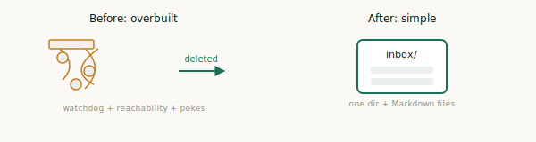

# 0.8.0 — agentchute, simple again

*We built a lot of machinery to solve a problem we created ourselves. Then we deleted it.*

agentchute is one idea: an inbox per agent, and a small Markdown protocol around it, so a mixed team of AI agents can hand off work without a human relaying messages. That's the whole thing. It's a good idea, and the protocol around it was sound.

Here's what happened.

As we ran agentchute with real teams — large and small, with genuinely good results — the *implementation* drifted. Not the idea; the code around it. It kept accumulating weight that had nothing to do with a shared inbox: machinery built to solve problems the protocol never actually had.

The root mistake was right at the start: **the sender poked the recipient** to come read its inbox. That one decision was the first wrong step, and it snowballed. Once a sender is responsible for waking a recipient, it has to know the recipient is reachable — so you add reachability tracking. Reachability goes stale — so you add a watchdog. The watchdog races — so you add liveness caches and gates to settle the races. Every addition was fixing a problem that only existed because of the original wrong turn.

We ended up with an intricate liveness subsystem wrapped around a protocol whose entire job is *drop a file in a directory*. The simple idea was still in there — it was just buried under everything we'd built to prop up that first bad decision.

So we stopped, and we went back to the idea: **a shared inbox, best-effort delivery, and the recipient is responsible for reading its own inbox.** Pull, not push. The sender writes the message and walks away.

That one change collapsed almost everything we'd been fighting. No sender poke means no reachability tracking, no watchdog, no liveness caches, no cross-agent gates — all deleted. What's left is what we wanted from the beginning: one small, universal way to run an agent — it watches its own inbox and reads it — that works the same for any terminal-based agent, because the protocol depends on no vendor behavior.

## What changed

- The sender no longer wakes anyone. Delivery is best-effort; the message waits in the inbox until the recipient reads it.
- Deleted: the watchdog, reachability caches, cooperative-wake, cross-agent liveness gates, and the per-vendor wake adapters we'd built to prop them up.
- Message identity is now a durable `(to, from, seq)` — a sender's messages stay ordered with no clock, and re-delivering the same one is a benign no-op.
- Reply obligations belong to the asker, so a silent recipient surfaces as the asker's own overdue item instead of a hang.
- The protocol's guarantees are now a small conformance suite — any implementation that passes it is conformant, on files, a queue, or anything else.

## What didn't change

- The idea: an inbox, a Markdown message, the recipient reads it.
- Still no server, no broker, no SDK. Still MIT. The reference implementation is real code — a small CLI and a per-agent supervisor — but it's separable from the protocol, and you can replace it with your own.
- The line that started this: stop using humans as a message bus.

## The lesson, if there is one

When you catch yourself adding machinery to fix a symptom, check whether the disease is a decision you can just remove. Ours was. Most of the complexity we deleted wasn't bad engineering — each piece was a reasonable fix for the piece before it. The problem was the thing at the bottom of the stack, and no amount of careful work further up could fix it. Pulling out one wrong assumption deleted more code than months of careful additions ever added.

**0.8 is the stable core we were looking for, not another churn.** We went looking for it, found it, and pinned it with a conformance suite so it stays put. From here, agentchute gets smaller and sharper — not bigger.
